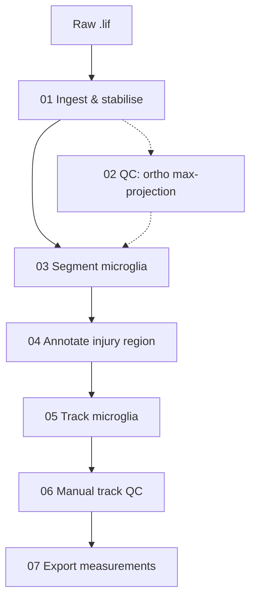

# Microglia Motility Pipeline — Quick Guide

Fiji/ImageJ pipeline for quantifying microglia motility in zebrafish spinal cord injury timelapses. Takes raw Leica `.lif` files through drift correction, automated segmentation, injury-region annotation, and cell tracking, producing curated track data ready for analysis.

<!-- SCREENSHOT: 01 -->

This is the **run-it guide**. For the reasoning behind each step, the tracker parameters, and the methods text, see the extended guide (`docs/EXTENDED.md`).

**Status:** Steps 1–6 are runnable end-to-end. Step 7 (measurement export) is in active development; Steps 8–9 (Python aggregation and graphs) are not built yet — come find me when you reach that point.

## Repository structure

```
microglia-motility-pipeline/
├── README.md          ← this guide
├── docs/EXTENDED.md   ← the "why": parameters, rationale, methods
├── fiji-macros/
│   ├── 01_ingest_stabilise/01_ingest_stabilise.groovy
│   ├── 02_qc/02_make_ortho_maxproject.ijm
│   ├── 03_segment/
│   │   ├── 03_mask_microglia.ijm
│   │   └── 03_microglia.classifier   ← use this; no training needed
│   ├── 04_annotate_injury/04_draw_injury.ijm
│   └── 05_track/05_trackmate_batch.groovy
└── python/            ← Steps 8–9, not built yet
```

## Before you start

You'll need Fiji with these plugins installed via **Help › Update › Manage update sites**:

| Used in | Plugin | Update site |
|---------|--------|-------------|
| Step 01 | [Bio-Formats](https://imagej.net/formats/bio-formats) | (bundled) |
| Step 01 | [Fast4DReg](https://imagej.net/plugins/fast4dreg) | https://sites.imagej.net/Fast4DReg/ |
| Step 03 | [Labkit](https://imagej.net/plugins/labkit/) | (bundled?) <!-- CHECK: confirm bundled vs update site --> |
| Step 04 | [MorphoLibJ](https://imagej.net/plugins/morpholibj) | https://sites.imagej.net/IJPB-plugins/ |
| Step 05 | [TrackMate](https://imagej.net/plugins/trackmate/) | (bundled) |

**You do not need to train a microglia segmentation classifier.** The trained model (`fiji-macros/03_segment/03_microglia.classifier`) is committed in the repo — just point Step 03 at it when prompted. You can skip `03_make_training_classifier.ijm` entirely; that's a one-time setup I've already done. (Only revisit it if your imaging setup turns out to differ enough that segmentation looks wrong — see the extended guide.)

## Pipeline overview



## Channel layout

The pipeline assumes (and builds up) this channel order. Several scripts depend on it, so it's the single most important convention to keep consistent. (Full reasoning lives in the extended guide.)

| Channel | Content | Added by |
|---------|---------|----------|
| 1 | All neurons (mnx:BFP) — used to locate the tissue body | acquisition |
| 2 | Microglia marker — what the classifier is trained on | acquisition |
| 3 | Injured neurons (dye uptake) | acquisition |
| 4 | Microglia binary mask — detected by TrackMate | Step 03 |
| 5 | Region label map (injured / uninjured) | Step 04 |

Steps 03 and 04 add their channels to the existing `_MIP.tif` **in place** — no new files are created; the image just gains channels.

## Run order

Work one series through the whole chain before moving to the next. Each step adds to or reads from the same `_MIP.tif`, so the filename stays constant until tracking produces an XML:

`.lif` → **01** → `*_corrected_xyz_MIP.tif` → **03** → +ch4 mask (in place) → **04** → +ch5 regions (in place) → **05** → `*_MIP.xml` → **06** → curated `*_MIP.xml`

1. **Ingest & stabilise** — `01_ingest_stabilise.groovy`

> [!NOTE]
> Run via **Plugins › Macros › Run…** or drag onto Fiji. In the dialog: pick your `.lif`, an output folder, the drift reference channel (default ch1), how many series (0 = all), and the drift-correction toggles. Use the `*_corrected_xyz_MIP.tif` output for the next step. A log and an auto-generated methods paragraph are saved alongside.

> [!TIP]
> **Optional QC** — run `02_make_ortho_maxproject.ijm` on the stabilised stack to eyeball the drift correction before committing.

2. **Segment microglia** — `03_mask_microglia.ijm`

> [!NOTE]
> Open the MIP image(s), run the macro, choose **Active image only** or **All open images**, and browse to `03_microglia.classifier` when asked. It classifies the microglia marker channel (default ch2) and appends the cleaned binary mask as **channel 4 of the existing `_MIP.tif`, in place** — no new file is written.

3. **Annotate injury region** — `04_draw_injury.ijm`

> [!NOTE]
> Run it, let it standardise orientation (head left, injury top — any flips are recorded in the filename as `_FH`/`_FV`) and auto-threshold the tissue body, then draw the injury boundary with the **segmented line** tool when prompted: click vertices along the boundary and double-click to finish, drawing edge to edge across the tissue (overshoot slightly). The region map (injured = 1, uninjured = 2) is appended as **channel 5 of the same `_MIP.tif`, in place**.

4. **Track microglia** — `05_trackmate_batch.groovy`

> [!NOTE]
> Run via **Plugins › Macros › Run…** or drag onto Fiji. Pick the folder containing your `*_MIP.tif` files — the script recurses through subfolders and processes all of them in batch. It detects microglia from the binary mask (ch4) and links them with the Advanced Kalman tracker (gap closing, track splitting and merging all disabled, for clean independent tracks). Out comes `*_MIP.xml` beside each source image, ready for curation.

5. **Manual track QC** — TrackMate GUI

> [!NOTE]
> **Plugins › TrackMate**, load the `*_MIP.xml`. If tracking is mostly good, fix individual tracks in the GUI. If it's poor, delete all tracks, switch to manual mode, and place spots over microglia frame by frame. Re-export the curated XML.

6. **Export measurements** *(in progress — come find me)*