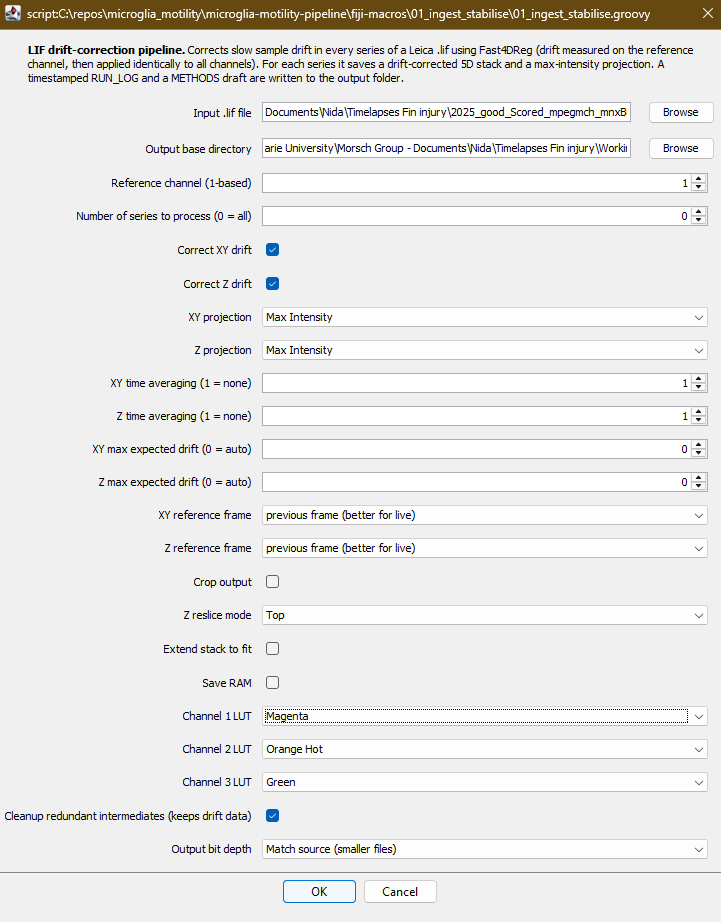
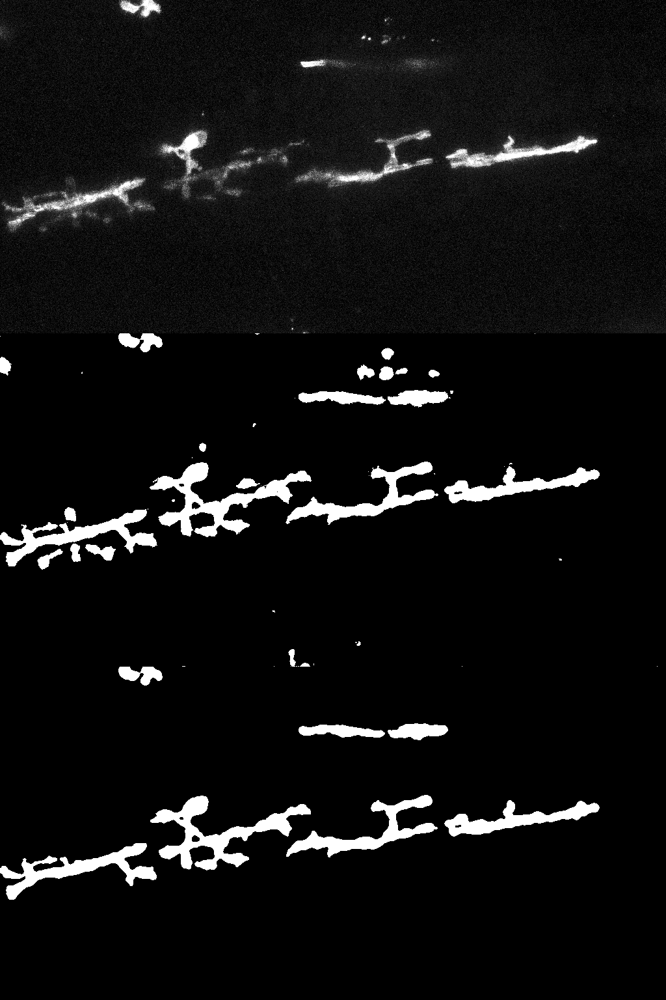

# Extended Guide — Microglia Motility Pipeline

The reasoning behind each stage: *why* it exists, *what* it does to the image, and *which* knobs you can safely turn. For the bare run-it instructions, see the [Quick Guide](../README.md).

The pipeline takes a raw Leica `.lif` timelapse and walks it through drift correction, microglia segmentation, injury-region annotation, automated tracking, manual curation, and CSV export. After Step 01 every stage reads from — and writes channels into — the same `*_corrected_xyz_MIP.tif` file, so the filename stays constant until tracking produces an XML.

---

## Contents

- [Conventions](#conventions)
- [Step 01 — Ingest & stabilise](#step-01--ingest--stabilise)
- [Step 02 — QC: stabilisation check](#step-02--qc-stabilisation-check)
- [Step 03 — Segment microglia](#step-03--segment-microglia)
- [Step 04 — Annotate injury region](#step-04--annotate-injury-region)
- [Step 05 — Track microglia](#step-05--track-microglia)
- [Step 06 — Curate tracks (manual)](#step-06--curate-tracks-manual)
- [Step 07 — Export to CSV](#step-07--export-to-csv)
- [What's next](#whats-next)

---

## Conventions

Every script depends on a fixed channel order. Steps 03 and 04 *append* channels to the existing `_MIP.tif` in place — no new files are created, the image simply gains a channel.

| Channel | Content | Added by |
|--------:|---------|----------|
| 1 | All neurons (mnx:BFP) — used to locate the tissue body | acquisition |
| 2 | Microglia marker — what the classifier is trained on | acquisition |
| 3 | Injured neurons (dye uptake) | acquisition |
| 4 | Binary microglia mask — detected by TrackMate | Step 03 |
| 5 | Region label map (injured / uninjured) | Step 04 |

**At a glance:**

| Step | Script | Reads | Writes |
|------|--------|-------|--------|
| 01 | `01_ingest_stabilise.groovy` | raw `.lif` | `*_corrected_xyz.tif`, `*_corrected_xyz_MIP.tif` |
| 02 | `02_make_ortho_maxproject.ijm` | two open stacks | display only (QC) |
| 03 | `03_mask_microglia.ijm` | `*_MIP.tif` | same file, + ch4 mask |
| 04 | `04_draw_injury.ijm` | `*_MIP.tif` | same file, + ch5 regions |
| 05 | `05_trackmate_batch.groovy` | `*_MIP.tif` | `*_MIP.xml` |
| 06 | TrackMate GUI | `*_MIP.xml` | curated `*_MIP.xml` |
| 07 | `07_export_csv_batch.groovy` | curated `*_MIP.xml` | `*_spots.csv`, `*_tracks.csv` |

---

## Step 01 — Ingest & stabilise
`01_ingest_stabilise.groovy`

### Why
A Leica `.lif` holds multiple series, each a 5D dataset (X, Y, Z, 3 channels, time). The sample drifts slowly over a timelapse; uncorrected, that drift is later misread as cell motility. This step extracts each series, corrects the drift, and saves a max-intensity projection for segmentation.

Drift is measured on one reference channel and the same shift applied to all three, preserving inter-channel registration. Correction is done by Fast4DReg v2.1 (NanoJ-Core cross-correlation), invoked unmodified via the SciJava ModuleService — not forked.

### Run it
**Plugins › Macros › Run…**, or drag onto Fiji, then fill in the dialog.

### Dialog fields
The first few are all you'll normally touch; the rest are safe at their defaults.

| Field | Default | What it does |
|-------|---------|--------------|
| Input `.lif` file | — | The raw Leica acquisition to process. |
| Output base directory | — | Where corrected stacks, MIPs, the run log and methods draft are written (one subfolder per series). |
| Reference channel (1-based) | 1 | The channel drift is measured on; the same shift is applied to all channels. Use the most stable structural marker (ch1, neurons). |
| Number of series (0 = all) | **2** | How many series to process. Defaults to 2 — set 0 to do the whole file. |
| Correct XY drift | on | Estimate and remove lateral (in-plane) drift. |
| Correct Z drift | on | Estimate and remove axial (depth) drift. |
| XY / Z projection | Max Intensity | Projection Fast4DReg uses internally to estimate drift in each axis. |
| XY / Z time averaging (1 = none) | 1 | Averages this many frames before estimating drift; raise it for noisy data to stabilise the estimate. |
| XY / Z max expected drift (0 = auto) | 0 | Caps the search range for drift; 0 lets Fast4DReg choose. |
| XY / Z reference frame | previous frame | Register each frame to the previous one (better for live imaging) or to the first frame (better for fixed). |
| Crop output | off | Crop away the blank borders left after shifting frames into alignment. |
| Z reslice mode | Top | Which face Fast4DReg reslices from when estimating Z drift. |
| Extend stack to fit | off | Grow the canvas to keep all shifted data rather than cropping it. |
| Save RAM | off | Conservative-memory mode for large stacks (slower). |
| Channel 1 / 2 / 3 LUT | Blue / Orange Hot / Green | Display colour for each channel in the saved composite (cosmetic; doesn't change pixel values). |
| Cleanup redundant intermediates | off | Delete the split single-channel working files afterwards, keeping the drift data and final outputs. |
| Output bit depth | Match source | "Match source" converts Fast4DReg's 32-bit float back to your acquisition depth without rescaling, keeping files small; "Keep 32-bit" retains the float. |



### Outputs
Per series, in a subfolder named after the series:

- `<series>_corrected_xyz.tif` — the drift-corrected 5D stack.
- `<series>_corrected_xyz_MIP.tif` — the Z-projection. **Every later step reads from and adds channels to this file.**
- `RUN_LOG_<timestamp>.txt` — a durable on-disk log (survives Fast4DReg clearing the Log window).
- `METHODS_drift_correction.txt` — an auto-generated, parameter-aware methods paragraph.

### Worth knowing
- One bad series is logged and skipped rather than aborting the batch.
- Frame interval is captured at import and re-stamped onto outputs, since Fast4DReg drops it; spatial calibration survives.

---

## Step 02 — QC: stabilisation check
`02_make_ortho_maxproject.ijm`

### Why
Optional but recommended. Before committing a stabilised stack to the rest of the pipeline, confirm the drift correction actually worked. Each orthogonal cross-view can be played as a movie — drift that survived correction shows up as wobble across time. The dual version puts two crosses side by side, so you can compare two stacks (e.g. before vs after correction, or two conditions) at a glance.

### Run it
Open the two stacks you want to compare, then run the macro. A dialog asks which open image goes on the **left** and which on the **right** (they must be different). For each, it builds an orthogonal cross — XY (top-left), YZ (top-right), XZ (bottom) from max-intensity projections — then combines the two crosses horizontally into a single `Orthogonal_combined` stack, with the time axis preserved so it plays as a movie.


*Two orthogonal crosses side by side, played across time. Each cross shows XY (top-left), YZ (top-right) and XZ (bottom). A well-corrected stack holds steady frame to frame; residual drift shows as wobble.*

### Output
A display-only `Orthogonal_combined` stack for visual QC — nothing is written to disk. If it looks steady, carry on to Step 03 with the `*_corrected_xyz_MIP.tif` from Step 01; if not, re-run Step 01 with adjusted drift parameters.

---

## Step 03 — Segment microglia
`03_mask_microglia.ijm`

### Why
Microglia must be picked out from the marker channel before they can be tracked. This step runs a trained Labkit classifier on the microglia channel (ch2), cleans the result, and appends it as a binary mask channel that TrackMate later detects from.

### Training the classifier (optional, one-time)
You won't normally need this — `03_microglia.classifier` ships in the repo; just point the macro at it. Only retrain if segmentation looks wrong on a meaningfully different imaging setup.

`03_make_training_classifier.ijm` builds one montage you can annotate across every dataset at once, which maximises the variety the classifier sees and helps it generalise. Point it at a parent folder of dataset subfolders; it keeps channel 2 of each `*MIP.tif` (via Arrange Channels), pads shorter timelapses with blank tail frames so time stays aligned across tiles, and tiles them into a grid (default 5 columns), saving `channel2_montage.tif` beside the data.

Then in Labkit: create one label per class, annotate **sparsely but representatively** — a few strokes per class across several tiles and timepoints, roughly balanced so no dataset dominates, and never on the blank padded tiles — train, inspect the overlay, add corrective strokes, retrain until happy, then save the `.classifier`.


*Left, the raw channel-2 fluorescence; right, the Labkit classifier's output. This is the raw classification, before the morphological cleanup below.*

### Run it
Open the MIP image(s), run the macro, then in the dialog pick a **run mode** and confirm the classifier path:

- **Active open image** — process the frontmost image only.
- **Batch folder (subdirs, `*_MIP.tif`)** — walk every subdirectory under a chosen parent and process each `*_MIP.tif`, overwriting it in place.

If the path is blank or "Browse for classifier file" is ticked, you'll get a file picker.

### What it does (per image)
Six steps: duplicate the marker channel → move time into frames (Labkit needs time in the frames dimension, not slices) → run the classifier → clean the mask (binarise, per-frame area opening, median smooth) → merge the cleaned mask back into the original as a new channel **in place** → close intermediates. The result is the same `_MIP.tif` with channel 4 added — no `_withMask` file is created.

### The cleanup stage
After Labkit classifies, the raw mask is refined in three sub-steps: binarise to strict 0/255, a per-frame area opening that drops objects smaller than `MIN_AREA` (debris and false positives), and a median smooth that tidies jagged edges without shrinking real cells. The area opening runs frame by frame because MorphoLibJ's operator is 2D-only.



*One frame at three stages — raw channel-2 fluorescence (top), the raw Labkit segmentation (middle), and the final cleaned mask (bottom). The cleanup drops objects below `MIN_AREA` (800 px²) and median-smooths the edges: note the small isolated specks in the middle panel that are removed in the bottom one, while the larger microglia structures are preserved.*

### Parameters (top of script)
| Variable | Default | What it does |
|----------|---------|--------------|
| `DEFAULT_CLASSIFIER` | `""` | Pre-fills the classifier path; leave empty to browse each time. |
| `CHANNEL_TO_KEEP` | 2 | Channel the classifier was trained on (ch2, microglia marker). |
| `MIN_AREA` | 800 | Minimum object area (px²); smaller objects are dropped as noise. |
| `MEDIAN_RADIUS` | 2 | Radius of the final median smoothing pass; tidies edges without shrinking objects. |
| `MIP_SUFFIX` | `_MIP.tif` | Batch mode only: processes files ending in this (case-insensitive). |

> [!NOTE]
> Merge Channels supports at most 7 colour slots, so the input image can have at most 6 channels for the mask to fit. The standard 3-channel MIP becomes 4-channel here, well within that limit.

### Output
The mask is appended as **channel 4** of the existing `_MIP.tif`, in place — in active mode the open window is updated; in batch mode the source file is overwritten.

---

## Step 04 — Annotate injury region
`04_draw_injury.ijm`

### Why
To compare microglial behaviour either side of the injury, each timelapse needs an injured-vs-uninjured region map. This step standardises orientation, auto-thresholds the tissue body, lets you draw the injury boundary, and appends the resulting label map as channel 5. Because all TrackMate analysers run in Step 05, each detection's mean channel-5 value is recorded in the XML — so tracks can be classified by region with no post-hoc spatial query.

### Run it
Open a `_MIP.tif` (or choose **Batch directory** to walk every `*_MIP.tif` under a folder), then work through two interactive prompts per image:

1. **Standardise orientation.** Read the anatomy channel and tell the dialog which way the head points and which side the injury is on. The script flips as needed to reach the standard (head left, injury top) and records any flips as `_FH_FV` in the window title — not the saved filename.
2. **Draw the injury boundary.** With only the neuron-trace channel shown (ch3, green) for clarity, use the **segmented line** tool: click vertices along the boundary, double-click to finish, drawing edge to edge (overshoot slightly). The macro re-prompts until a line selection is actually active, so an empty OK won't slip through.

From there it auto-thresholds the tissue from ch1 frame 1, extends your line into a polygon to split the tissue top/bottom (injured = 1, uninjured = 2), replicates the label map across all frames, and appends it as the next channel — overwriting the source file in place.


*The overlay onto the output — the cyan tissue outline and the in-tissue cut line. Use it to check the result is sensible.*

> [!TIP]
> **Check it worked.** There's no automatic validation, so it's worth a quick look at the cyan overlay before moving on: the tissue outline should hug the fin body (not leak into background or miss a chunk), and the cut line should sit where you intended, spanning the tissue edge to edge. If the outline looks wrong, the tissue threshold is the usual culprit — adjust `BLUR_SIGMA` or `THRESHOLD_METHOD` and re-run. You can also scrub through frames to confirm the label map is present on every timepoint.

### Parameters (top of script)
| Variable | Default | What it does |
|----------|---------|--------------|
| `TISSUE_CHANNEL` | 1 | Channel auto-thresholded for the tissue body (anatomy). |
| `TRACE_CH_A` / `TRACE_CH_B` | 1 / 3 | Channels shown while drawing — anatomy (magenta) + neuron trace (green). |
| `BLUR_SIGMA` | 10 | Gaussian blur before thresholding; merges signal into one tissue mass. |
| `THRESHOLD_METHOD` | Percentile | Auto-threshold method for the tissue body (deliberately loose). |
| `LABEL_INJURED` / `LABEL_UNINJURED` | 1 / 2 | Pixel values written into the region map. |
| `OVERLAY_COLOR` / `OVERLAY_WIDTH` | cyan / 2 | Colour and width of the QC overlay. |
| `TARGET_HEAD` / `TARGET_INJURY` | left / top | Orientation everything is normalised to. |

> [!NOTE]
> The region map is appended additively, so the save is non-destructive in effect — you can strip the last channel any time to recover the original data. For a standard 4-channel `_MIP.tif` input this yields the 5-channel layout: anatomy, marker, trace, mask, regions. Merge Channels caps at 7 slots, so the input may have at most 6 channels.

### Output
The same `_MIP.tif`, overwritten in place with the region label map added as **channel 5**. In batch mode every `*_MIP.tif` under the chosen folder is processed in turn — note each one needs interactive input (orientation dialog plus line draw), and because ImageJ macros have no try/catch, an error on any file (e.g. no line drawn) halts the whole batch.

---

## Step 05 — Track microglia
`05_trackmate_batch.groovy`

### Why
With a clean binary mask in channel 4, microglia can be detected and linked across time. This step runs TrackMate headlessly over a whole folder: it detects every mask object with the **MaskDetector** on ch4 and links them frame to frame with the **Advanced Kalman tracker**. It deliberately produces a *complete, unfiltered* set — no spot filters, no track filters — so that nothing is discarded before a human has looked at it in Step 06.

Because the run enables **all** analysers, the XML carries per-channel intensity means (including the ch5 region label), morphology (area, circularity, convexity), and track kinematics — everything Step 07 needs, with no image left open.

### Run it
**Plugins › Macros › Run…**, or drag onto Fiji. Set `INPUT_DIR`, or leave it empty for a folder-picker at runtime; the script then walks the tree recursively for `*_MIP.tif` files and processes each in batch. A failed file is logged and skipped — the batch carries on.

### Parameters (CONFIG block, top of script)
Only the first three are meant for routine use. The tracker distances are tuned values, not preferences — the script carries a `DO NOT change without re-tuning on labelled data` warning, and they're all in microns.

| Variable | Default | What it does |
|----------|---------|--------------|
| `INPUT_DIR` | `""` | Root folder to scan (recursively) for `*_MIP.tif`. Leave empty to get a folder-picker dialog at runtime. |
| `MASK_CHANNEL` | 4 | Channel TrackMate detects from — the cleaned binary microglia mask appended by Step 03. |
| `SHOW_RESULT` | false | Set `true` to render tracks in the GUI for a spot-check; leave `false` for headless batch runs. |
| `LINKING_MAX` | 50.0 | Max distance (µm) to link a spot between consecutive frames. |
| `KALMAN_SEARCH` | 75.0 | Kalman predictive search radius (µm) for the next position. |
| `GAP_CLOSING_MAX` | 15.0 | Max distance (µm) to bridge a gap — **inactive**, gap closing is disabled. |
| `SPLITTING_MAX` | 15.0 | Max distance (µm) for a track split — **inactive**, splitting is disabled. |
| `MERGING_MAX` | 15.0 | Max distance (µm) for a track merge — **inactive**, merging is disabled. |
| `ALT_COST_FACTOR` | 1.05 | Alternative (non-linking) cost factor in the LAP solver. |
| `CUTOFF_PERCENTILE` | 0.9 | Percentile cutoff applied when building the cost matrix. |
| `MAX_FRAME_GAP` | 1 | Max frames a track may skip; with gap closing off this stays effectively at single-frame linking. |

> [!NOTE]
> Gap closing, splitting and merging are switched **off** in this step (`ALLOW_GAP_CLOSING`, `ALLOW_TRACK_SPLITTING`, `ALLOW_TRACK_MERGING` all `false`), so their three distance values have no effect at the defaults — they're set up ready for if you choose to enable those behaviours during curation. The detector keeps **every** mask object (no spot filters) and **no** track filters are applied, so the XML is the complete, unfiltered set handed off for manual curation.

### Output
One `*_MIP.xml` written beside each source image (the `_MIP.tif` suffix becomes `_MIP.xml`), holding the model, settings, and a per-image log. This is the handoff artefact for Step 06 — reopen it from disk to curate.

---

## Step 06 — Curate tracks (manual)
*in TrackMate*

### Why
Step 05 deliberately produces a *complete, unfiltered* set of spots and tracks — no spot or track filters are applied — so that nothing is discarded before a human has looked at it. This step is where you do that: open each `_MIP.xml` in TrackMate and correct the automated tracking.

The focus of curation is **microglial identity** — checking that each track follows the *same* cell across time, and fixing it where the Kalman tracker has jumped between cells, swapped identities, or broken one cell into several tracks. You can also **delete macrophage tracks that fall outside the ROI** if you don't want them carried forward; the unfiltered output keeps them in by design, so removing them here is a deliberate curation choice rather than a correction.

### How
1. In Fiji: **Plugins › Tracking › Load a TrackMate file**, and select the `_MIP.xml` written beside the image by Step 05.
2. Curate using **TrackScheme**, TrackMate's track editor — it lays tracks out as a frame-by-frame lineage graph where you can select, link, unlink, and edit spots directly. This is standard TrackMate functionality, so rather than reproduce it here, see the official documentation:
   - TrackMate manual (PDF): https://imagej.net/media/plugins/trackmate/trackmate-manual.pdf
   - Manual tracking / editing tutorial: https://imagej.net/plugins/trackmate/tutorials/manual-tracking
3. **Save back to the same XML** (TrackMate › Save) so downstream steps read your curated tracks rather than the raw output.

### Worth knowing
Manually added spots are drawn as perfect circles, so they carry a circularity of ~1, whereas the mask-detector spots from Step 05 inherit the irregular outline of the segmented cell. Because the run enables all analyzers — including morphology metrics like circularity — downstream steps can read that perfect-circle morphology to tell hand-annotated spots apart from the automated ones.

### Handy: quick-open helper (`05_tiny_tracking_inspector.ijm`)
A tiny convenience macro that saves a few clicks each time you open an XML to curate. It runs **Load a TrackMate file**, then sets the display to show channel 2 only and switches it to the Grays LUT — i.e. it drops you straight into a clean grayscale view of the marker channel, ready to start curating in TrackScheme. Purely a display shortcut; it changes nothing in the data or the saved XML.

---

## Step 07 — Export to CSV
`07_export_csv_batch.groovy`

### Why
The curated `_MIP.xml` from Step 06 holds everything, but it's not analysis-ready. This step reads every curated XML under a chosen folder and writes two CSVs beside each one — a per-spot table and a per-track table — so you can load tracking results straight into pandas or R. No image needs to be open: every feature was already computed by Step 05's `addAllAnalyzers()` and stored in the XML.

### Run it
**Plugins › Macros › Run…**, or drag onto Fiji. Set `INPUT_DIR`, or leave it empty for a folder-picker at runtime; the script then walks the tree recursively for `*_MIP.xml` files.

### Parameters (CONFIG block, top of script)
| Variable | Default | What it does |
|----------|---------|--------------|
| `INPUT_DIR` | `""` | Root folder scanned (recursively) for `*_MIP.xml`. Leave empty for a folder-picker dialog. |
| `VISIBLE_ONLY` | `true` | `true` exports only spots/tracks visible in a track that passed filters; `false` also includes unlinked singleton detections (their `TRACK_ID` is left empty). |

### Outputs
Per curated XML, written beside it:
- `<base>_spots.csv` — one row per spot per frame.
- `<base>_tracks.csv` — one row per track (aggregate kinematics).

Both use TrackMate's four-row header: row 1 is ALL_CAPS machine-readable keys, rows 2–4 are human names, short abbreviations, and units. Read the spots file in pandas with the keys as column names:

```python
df = pd.read_csv(path, header=0, skiprows=[1, 2, 3])
```

### Worth knowing
- **Region classification lives in the spots file**, in `MEDIAN_INTENSITY_CH5`: `1.0` = injured zone, `2.0` = uninjured zone. Median is used rather than mean so that a spot straddling the injury boundary snaps to whichever side holds most of its pixels; for spots wholly inside one region the two are identical.
- **The tracks CSV has no region column** — derive it from the spots, e.g. `spots.groupby('TRACK_ID')['MEDIAN_INTENSITY_CH5'].median().round()` (1 = injured, 2 = uninjured).

---

## What's next

Steps 08–09 (Python aggregation and graphs) are not built yet. The plan is to pool every `*_spots.csv` / `*_tracks.csv` into a single master spreadsheet, join region labels onto tracks (`spots.merge(tracks, on="TRACK_ID")`), and compute per-condition motility summaries — work intended for a Google Colab notebook.
